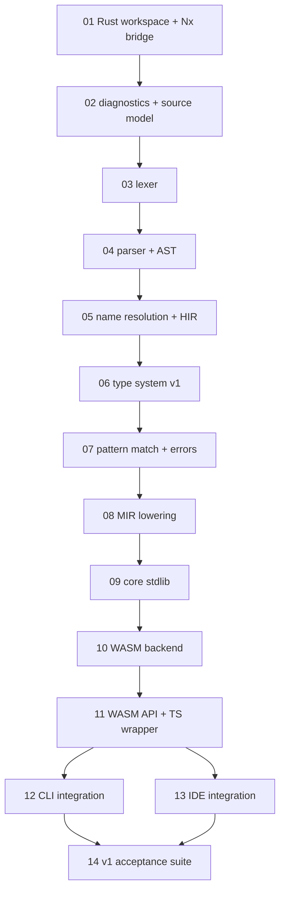

# Maodie v1 任务手册

## 目标

本手册把 Maodie v1 拆成可交接的阶段级任务。v1 的完成状态是：`.mao` 示例源码可以通过 CLI 和浏览器 IDE 调用同一套 Rust/WASM 编译器核心，编译到 WASM，并显示中文诊断、IR/WASM 调试输出。

## 技术路线

- 语言风格：Rust-like 语法和类型系统，托管内存，英文关键字，Unicode 标识符。
- 编译器核心：Rust 实现，手写 lexer/parser，AST -> HIR -> MIR -> WASM。
- 工具层：Nx 编排 Rust、WASM、TypeScript wrapper、CLI 和 IDE。
- 标准库范围：v1 只包含 core 标准库，暂缓完整应用标准库。

## 任务顺序

1. `01-rust-workspace-and-nx-bridge.md`
2. `02-diagnostics-and-source-model.md`
3. `03-lexer.md`
4. `04-parser-and-ast.md`
5. `05-name-resolution-and-hir.md`
6. `06-type-system-v1.md`
7. `07-pattern-match-and-errors.md`
8. `08-mir-lowering.md`
9. `09-core-stdlib.md`
10. `10-wasm-backend.md`
11. `11-wasm-api-and-ts-wrapper.md`
12. `12-cli-integration.md`
13. `13-ide-integration.md`
14. `14-v1-acceptance-suite.md`
15. `15-core-log-formatting.md`

任务 01-10 是核心主线。任务 12 和 13 在任务 11 的 WASM API 稳定后可以并行推进。任务 14 必须等 10-13 都完成后执行。

## 后续专题任务

- `highlighting/README.md`：语法级代码染色任务链，包含通用 highlight API、WASM/TS wrapper、跨 IDE 适配契约，以及每个任务独立的交接文档和验收文档。
- `15-core-log-formatting.md`：v1 闭环后的 core 日志格式化专题任务，记录 `{}` 插值、直接 `String` handle 和 CLI/IDE log chunk flushing。

## 依赖图

## 每个任务的固定结构

- `目标`：本任务要交付什么。
- `对应特性`：语言、编译器、工具链或 IDE 哪方面能力。
- `前置输入`：必须来自哪些上游任务的产物。
- `实现范围`：本任务必须完成的行为边界。
- `不做事项`：防止任务膨胀。
- `输出产物`：代码模块、API、测试、文档、示例或 dump 格式。
- `验收标准`：可执行命令、测试场景、示例输入输出。
- `完成后验收方式`：任务结束后复验者要执行的命令、人工检查点和交接记录要求。
- `交接给下一任务`：下一任务需要读取哪些文件、调用哪些接口、信任哪些不变量。
- `风险与注意`：容易返工或影响后续设计的点。
- `交接记录`：任务完成后更新。

## 完成后验收流程

每个任务完成后，执行者先按本任务的 `完成后验收方式` 自检，再把命令结果和人工检查结论写入 `交接记录`。复验者不依赖口头说明，只读取任务文件、变更 diff、测试输出和交接记录。

通用复验顺序：

1. 确认本任务 `输出产物` 全部存在。
2. 执行本任务列出的命令，记录通过或失败原因。
3. 人工检查本任务的 `不做事项` 没有被偷偷实现。
4. 检查公共接口或 dump 格式是否同步写入下游任务的 `前置输入`。
5. 更新 `交接记录`：完成摘要、公共接口变更、测试命令结果、已知限制、下一任务入口。

## 交接协议

上一个任务完成时，必须在自己的任务文件末尾更新 `交接记录`。交接记录必须包含完成摘要、变更的公共接口、测试命令结果、已知限制、下一任务入口。

下一个任务开始前，必须先读自己的任务文件，以及所有 `前置输入` 任务的 `交接记录`。如果公共接口变更影响下游任务，必须同步更新所有直接下游文件的 `前置输入` 和 `交接给下一任务`。

每个任务只依赖已验收产物，不依赖实现者口头说明。未完成任务的 `交接记录` 保持 `状态：未开始`。

## 完成定义

一个任务只有在代码、测试、文档、示例和交接记录都同步后才算完成。对外接口必须稳定到足够支撑直接下游任务，不允许把关键设计留给下一个任务猜。
