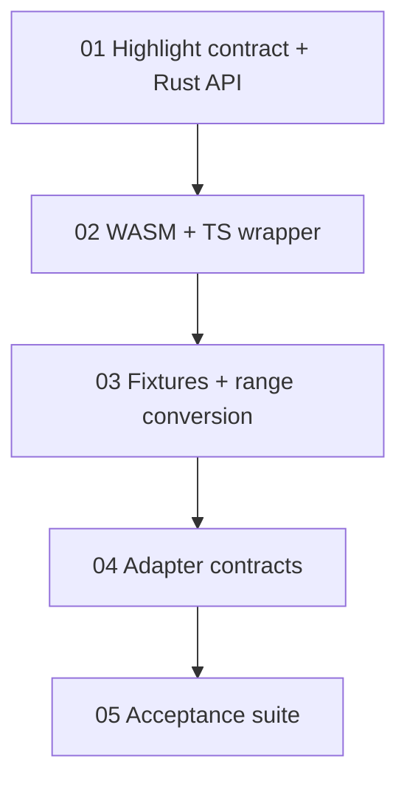

# Maodie Syntax Highlighting Task Chain

## 目标

为 Maodie 建立语法级代码染色的通用能力。第一阶段只交付通用 token/highlight API、WASM/TS wrapper、跨编辑器适配契约和验收套件，不实现完整 VSCode 或 JetBrains 插件。

## 技术路线

- Rust `maodie_syntax` lexer 是唯一事实来源。
- 通用层输出稳定 `HighlightToken`，不输出颜色值。
- IDE 适配层负责把 `HighlightToken` 映射到 Web IDE、VSCode、JetBrains 各自的高亮模型；契约文档位于 `adapters/`。
- 第一版只做语法级染色，不区分函数名、类型名、局部变量、字段或 enum variant 等语义 token。

## 任务顺序

| 顺序 | 任务 | 状态 | 主要产物 |
| --- | --- | --- | --- |
| 1 | `01-highlight-contract.md` | 已完成 | Rust `highlight_source`、`HighlightKind`、`HighlightToken`。 |
| 2 | `02-highlight-wasm-and-ts.md` | 已完成 | WASM `maodie_highlight` ABI、TS `MaodieCompilerWasm.highlight` / `highlightMaodieSource`。 |
| 3 | `03-highlight-fixtures-and-ranges.md` | 已完成 | 共享 fixture、golden tokens、UTF-8 byte range 到 UTF-16 editor range helper。 |
| 4 | `04-highlight-adapter-contracts.md` | 已完成 | Web IDE、VSCode、JetBrains adapter 契约和 unknown fallback 规则。 |
| 5 | `05-highlight-acceptance-suite.md` | 已完成 | 最终 smoke 测试、验收命令汇总、后续插件任务入口。 |

每个任务都有独立交接文档和验收文档：

- `NN-*-handoff.md`：上游任务完成后写入实际公共接口、测试结果、限制和下一任务入口。
- `NN-*-acceptance.md`：复验者按文档执行命令和人工检查，记录验收结论。

## 适配契约

- `adapters/index.md`：所有平台共享的输入契约、range 转换要求和 fallback 规则。
- `adapters/web-ide.md`：Web IDE 到 CodeMirror/Monaco 的 token class 映射。
- `adapters/vscode.md`：VSCode semantic token 与 TextMate fallback 映射策略。
- `adapters/jetbrains.md`：JetBrains `TextAttributesKey` 映射策略。

三类 adapter 契约均覆盖 `keyword`、`identifier`、`comment`、`string`、`number`、`boolean`、`operator`、`punctuation`、`error`，并明确 unknown kind 必须降级为 plain/default，不得中断渲染。

## 验收命令汇总

- `cargo fmt --all --check`
- `cargo test --workspace`
- `pnpm typecheck`
- `pnpm test`
- `pnpm style:guard`

最终 TS smoke 位于 `packages/compiler-wasm/src/index.test.ts`，通过 `highlightMaodieSource` 读取共享 fixture，验证 tokens、diagnostics、error token 和中文标识符 range 转换。

## 后续任务入口

- Web IDE：从 `web-ide/README.md` 开始，按任务链实现 Rust/WASM 真增量 highlighter、CodeMirror 6 editor shell、decorations 和实时 lexer diagnostics。
- VSCode：从 `adapters/vscode.md` 开始，实现 `DocumentSemanticTokensProvider`、diagnostics collection 和 fixture smoke test。
- JetBrains：从 `adapters/jetbrains.md` 开始，实现 highlight 驱动的 lexer adapter、`SyntaxHighlighter` 映射和 fixture smoke test。

## Web IDE 增量染色任务链

`web-ide/README.md` 拆分了 Web IDE 真实增量代码染色的后续任务：

- Rust incremental highlight session。
- WASM/TS wrapper 和 Web Worker session。
- CodeMirror 6 editor shell。
- highlight decorations 和实时 lexer diagnostics。
- 浏览器 smoke、性能基准和最终验收闭环。

## 依赖图

## 完成定义

一个 highlighting 任务只有在以下内容都完成后才算结束：

- 任务文件列出的代码或文档产物已落地。
- 对应验收文档的命令和人工检查已通过。
- 对应交接文档已更新为 `状态：已完成`。
- 下游任务的前置输入不需要实现者口头补充。
