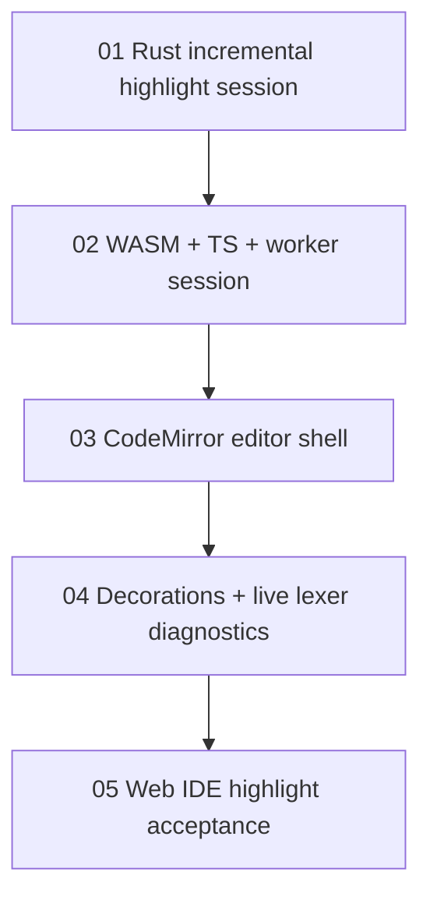

# Web IDE Incremental Highlighting Task Chain

## 目标

把 Maodie Web IDE 从 plain `textarea` 升级为 CodeMirror 6 编辑器，并接入真正增量的语法级代码染色。增量能力由 Rust/WASM highlight session 维护 source、token cache 和 diagnostics，Web 层只负责编辑器集成、worker 通信、decorations 和实时词法诊断展示。

## 技术路线

- CodeMirror 6 是 Web IDE 编辑器内核。
- Rust lexer 仍是 Maodie token 分类的唯一事实来源。
- 增量染色放在 Rust/WASM session 中，Web 层不得重新实现 Maodie lexer。
- Web Worker 承载 WASM session，主线程只处理 CodeMirror、decorations 和 UI 状态。
- 实时 diagnostics 只包含 lexer diagnostics；parser/typechecker diagnostics 仍由 Run/compile 产生。

## 任务顺序

| 顺序 | 任务 | 状态 | 主要产物 |
| --- | --- | --- | --- |
| 1 | `01-incremental-highlight-session.md` | 未开始 | Rust `IncrementalHighlightSession`、edit delta 模型、增量 relex 同步算法。 |
| 2 | `02-wasm-ts-worker-session.md` | 未开始 | WASM session ABI、TS session wrapper、`highlight.worker.ts` 协议。 |
| 3 | `03-codemirror-editor-shell.md` | 未开始 | Web IDE 从 `textarea` 切换到 CodeMirror 6，保留现有编译流程。 |
| 4 | `04-decorations-live-lexer-diagnostics.md` | 未开始 | `HighlightKind -> mao-hl-*` decorations 和实时 lexer diagnostics。 |
| 5 | `05-web-ide-highlight-acceptance.md` | 未开始 | 浏览器 smoke、性能基准、最终验收记录和后续入口。 |

每个任务都有独立交接文档和验收文档：

- `NN-*-handoff.md`：执行者完成任务后写入公共接口、测试结果、限制和下一任务入口。
- `NN-*-acceptance.md`：复验者按文档执行命令和人工检查，记录验收结论。

## 依赖图

## 完成定义

一个 Web IDE 增量染色任务只有在以下内容都完成后才算结束：

- 任务文件列出的代码、测试、文档或 smoke 产物已落地。
- 对应验收文档中的命令和人工检查通过。
- 对应交接文档已更新为 `状态：已完成`。
- 下游任务可以只读取自己的任务文件和上游交接文档开始工作。

## 后续入口

任务 05 完成后，Web IDE 可以进入后续增强任务：

- 语义级 token 叠加。
- parser/typechecker 实时 diagnostics。
- VSCode 和 JetBrains 插件实现。

