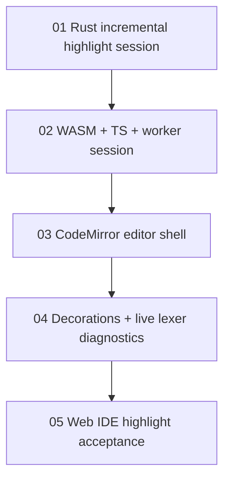

# Web IDE Incremental Highlighting Task Chain

## 目标

把 Maodie Web IDE 从 plain `textarea` 升级为浏览器代码编辑器，并接入真正增量的语法级代码染色。增量能力由 Rust/WASM highlight session 维护 source、token cache 和 diagnostics，Web 层只负责编辑器集成、worker 通信、semantic tokens/markers 和实时词法诊断展示。当前 Web IDE 编辑器内核为 Monaco Editor；原 CodeMirror 任务链保留为历史增量高亮建设记录。

## 技术路线

- Monaco Editor 是当前 Web IDE 编辑器内核。
- Rust lexer 仍是 Maodie token 分类的唯一事实来源。
- 增量染色放在 Rust/WASM session 中，Web 层不得重新实现 Maodie lexer。
- Web Worker 承载 WASM session，主线程只处理 Monaco、semantic tokens、markers 和 UI 状态。
- 实时 diagnostics 只包含 lexer diagnostics；parser/typechecker diagnostics 仍由 Run/compile 产生。

## 任务顺序

| 顺序 | 任务 | 状态 | 主要产物 |
| --- | --- | --- | --- |
| 1 | `01-incremental-highlight-session.md` | 已完成 | Rust `IncrementalHighlightSession`、edit delta 模型、增量 relex 同步算法。 |
| 2 | `02-wasm-ts-worker-session.md` | 已完成 | WASM session ABI、TS session wrapper、`highlight.worker.ts` 协议。 |
| 3 | `03-codemirror-editor-shell.md` | 已完成 | Web IDE 从 `textarea` 切换到 CodeMirror 6，保留现有编译流程。 |
| 4 | `04-decorations-live-lexer-diagnostics.md` | 已完成 | `HighlightKind -> mao-hl-*` decorations 和实时 lexer diagnostics。 |
| 5 | `05-web-ide-highlight-acceptance.md` | 已完成 | 浏览器 smoke 自动化、性能基准、最终验收记录和后续入口。 |

每个任务都有独立交接文档和验收文档：

- `NN-*-handoff.md`：执行者完成任务后写入公共接口、测试结果、限制和下一任务入口。
- `NN-*-acceptance.md`：复验者按文档执行命令和人工检查，记录验收结论。

## Monaco 重构任务链

当前编辑器内核已通过 [`monaco-editor/README.md`](monaco-editor/README.md) 任务链迁移到 Monaco Editor：

| 顺序 | 任务 | 状态 | 主要产物 |
| --- | --- | --- | --- |
| 1 | `monaco-editor/01-monaco-language-contract.md` | 已完成 | Monaco language/theme、semantic token legend、range/marker helpers。 |
| 2 | `monaco-editor/02-monaco-editor-shell.md` | 已完成 | Monaco editor shell 和稳定 `MaodieEditor` source API。 |
| 3 | `monaco-editor/03-monaco-highlight-diagnostics.md` | 已完成 | WASM highlight worker 到 Monaco semantic tokens/markers 的接入。 |
| 4 | `monaco-editor/04-monaco-acceptance-and-docs.md` | 已完成 | Monaco smoke 自动化、模块文档和最终验收入口。 |

## 依赖图

## 完成定义

一个 Web IDE 增量染色任务只有在以下内容都完成后才算结束：

- 任务文件列出的代码、测试、文档或 smoke 产物已落地。
- 对应验收文档中的命令和人工检查通过。
- 对应交接文档已更新为 `状态：已完成`。
- 下游任务可以只读取自己的任务文件和上游交接文档开始工作。

## 后续入口

任务 05 完成后，Web IDE 可以进入后续增强任务：

- 语义级 token 叠加。
- parser/typechecker 实时 diagnostics。
- VSCode 和 JetBrains 插件实现。

## 最终验收命令

任务 05 汇总的 Web IDE 增量染色验收命令：

- `cargo fmt --all --check`
- `cargo test --workspace`
- `pnpm typecheck`
- `pnpm test`
- `pnpm ide:build`
- `pnpm style:guard`
- `node tools/ide-highlight-smoke.mjs <ide-url> <chrome-devtools-url>`，其中 IDE 需由 `pnpm ide:dev` 启动，Chrome 需以 `--remote-debugging-port` 启动。

浏览器 smoke 覆盖默认示例高亮、中文标识符和 emoji 附近编辑、未闭合字符串、块注释开闭、非法字符 error token/live diagnostic、示例切换、Run 编译当前 Monaco 文档，以及连续输入时 worker 过期响应不覆盖新状态。

Monaco 重构后的 smoke 通过 `window.maodieIdeEditor` 测试 hook 驱动当前文档，覆盖同样场景，并额外确认 semantic token 与 live marker 计数可见。
