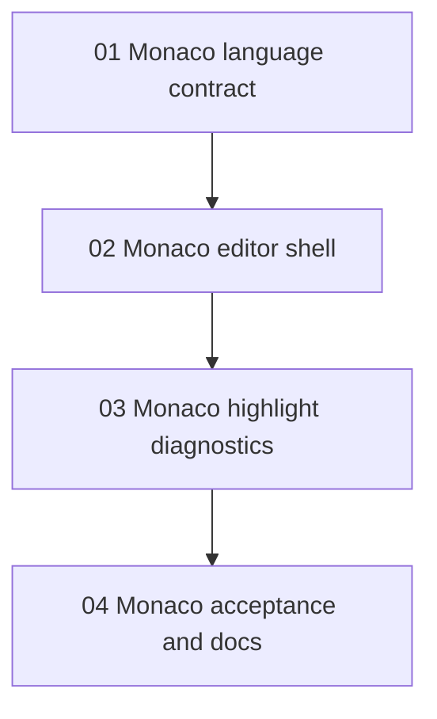

# Web IDE Monaco Editor Refactor Task Chain

## Goal

Replace the Web IDE editor core from CodeMirror 6 to Monaco Editor while preserving the existing Maodie WASM highlight worker, live lexer diagnostics, example switching, and manual Run/evaluate flow.

## Task Order

| Order | Task | Status | Main Output |
| --- | --- | --- | --- |
| 1 | `01-monaco-language-contract.md` | Completed | Monaco language id, theme, semantic token legend, range helpers, and marker conversion helpers. |
| 2 | `02-monaco-editor-shell.md` | Completed | Monaco editor shell behind the existing `MaodieEditor` source read/replace/destroy API. |
| 3 | `03-monaco-highlight-diagnostics.md` | Completed | Monaco adapter for the existing highlight worker session, semantic token updates, and model markers. |
| 4 | `04-monaco-acceptance-and-docs.md` | Completed | Smoke test updates, module docs, and final verification loop. |

## Dependency Graph

## Completion Definition

Each task is complete when its code or documentation outputs are landed, the handoff document records the public interfaces and validation results, and the acceptance document gives reviewers deterministic commands plus manual review checks. Downstream tasks depend on upstream handoff documents, not chat history.

## Final Acceptance Commands

- `pnpm nx run ide:test`
- `pnpm nx run ide:typecheck`
- `pnpm ide:build`
- `node tools/ide-highlight-smoke.mjs <ide-url> <chrome-devtools-url>`
- `pnpm style:guard`

